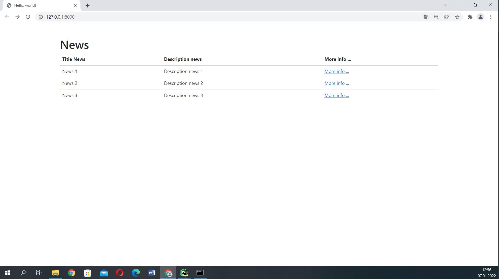
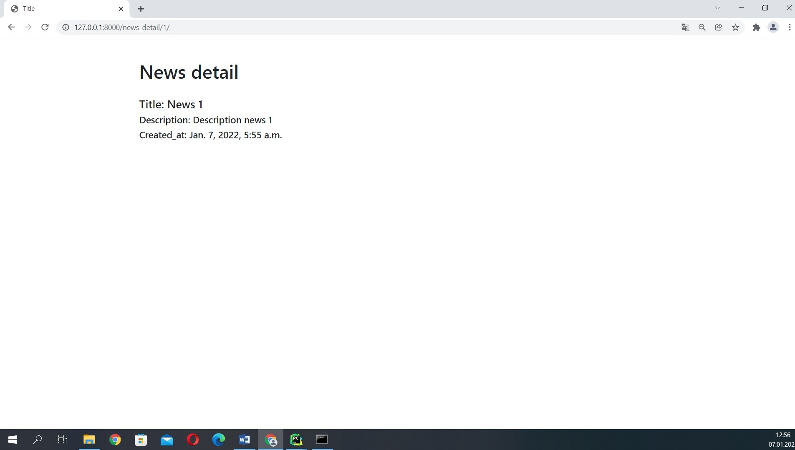
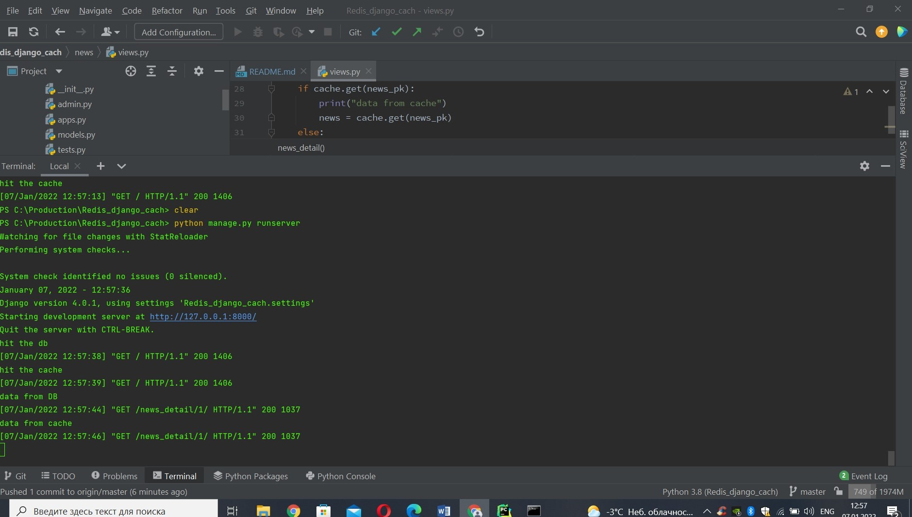
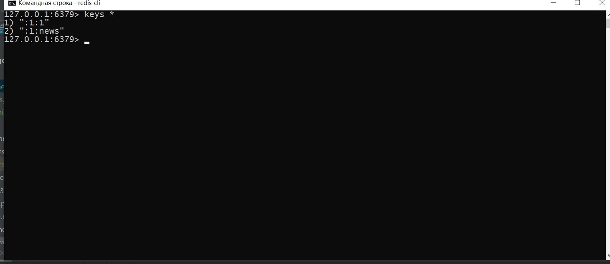

Redis - used as a database(nosql), cache, and message broker.
====

# install
      sudo apt-get update
      sudo apt-get upgrade
      sudo apt-get install redis-server
      redis-cli -v # redis-cli 5.0.7

# restart server
      sudo service redis-server restart
      Stopping redis-server: redis-server.
      Starting redis-server: redis-server.

# uninstall - if you use apt-get to install redis then use
      sudo apt-get purge --auto-remove redis-server

# for Windows 10
      https://github.com/microsoftarchive/redis/releases

#check connect
      redis-cli
      127.0.0.1:6379> ping
      PONG

# exit
      127.0.0.1:6379> exit
      admin1@DESKTOP-G881Q5V:~$

Install package
==================================================================

        pip install redis

      CACHES = {
          'default': {
              'BACKEND': 'django.core.cache.backends.redis.RedisCache',
              'LOCATION': 'redis://127.0.0.1:6379',
          }
      }

1. Home

   
   
2. News

   

3. Terminal

   

4. Redis

   